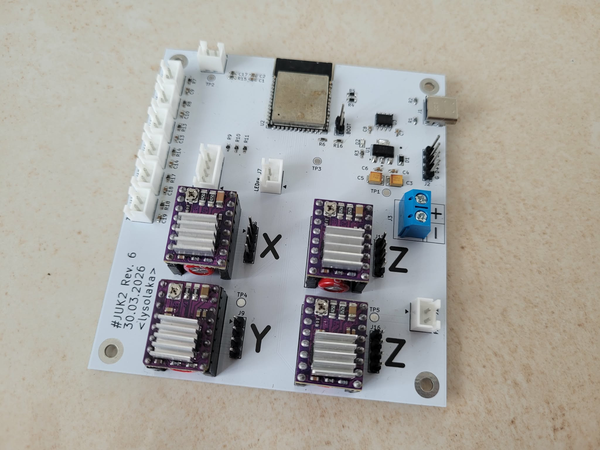

# JUK2

JUK2 is a CNC plotter firmware for the ESP32-S3 on a custom PCB and plotter frame.

JUK2 is the successor of JUK - a private, messy and ugly project. The project's second version is supposed to be everything the first one was not able to be.

# Hardware

The custom design can be found under the `juk-pcb` directory. It also has a schematic and a STEP model available for those, who don't have KiCad installed.

The machine operates in Cartesian coordinates using four motors: one for X and Y axes each, and two for the Z axis. The X axis is realized as a moving table, the Y axis is being moved up and down by the Z axis. The X and Y assemblies operate using a belt pulley, the Z axis moves the Y axis assembly using trapezoidal screws from both ends of the axis (hence the need for two motors).

*TODO:* add a nice photo of the machine

# Software

Just like the first edition of JUK, the entire software stack is developed using Rust. This time the project is split into crates in a single workspace. The structure is as follows:
- `juk-com`: a communication library implementing text and binary interfaces
- `juk-firmware`: the main firmware executable
- `juk-led`: a simple library to use an RGB LED using PWM
- `juk-motion`: motion profiles and interpolators library

## Toolchain

Building this project requires the Xtensa Rust Toolchain, detailed installation instructions can be found [here](https://docs.espressif.com/projects/rust/book/getting-started/toolchain.html). Additionaly the [espflash](https://github.com/esp-rs/espflash/tree/main/espflash) utility is needed to flash the program onto the board.

# License

All code and design files in this repository are licensed under the GPL-3 license.
